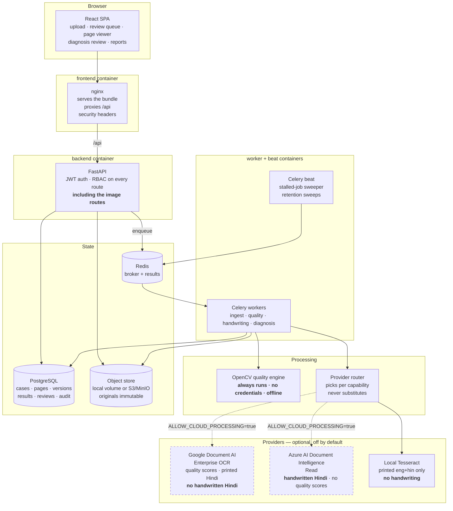

# OPD Scan QC

A quality-control system for scanned hospital case files. It takes the PDFs and
photographs produced by a records-digitisation team, measures how readable each
page actually is, flags the pages that need rescanning, points out where
handwriting sits, and transcribes any diagnosis that is *already written on the
page* so that a human can check it.

It is a checking tool for a scanning workflow. It is not a clinical tool.

---

## What it does

| | |
|---|---|
| **Ingest** | Accepts PDFs and images, rasterises each page, and gives every page a stable identity (`logical_page`) so a rescan attaches to the page it replaces rather than creating a duplicate. Version 1 is never overwritten. |
| **Measure quality** | A local OpenCV engine measures every page — sharpness, ink-to-paper separation, exposure, noise, skew, orientation, glare, shadow, bit depth, estimated text height, edge cut-off — and classifies it as `acceptable`, `review`, `rescan`, `blank`, `failed` or `unchecked`. |
| **Explain the verdict** | Each classification carries findings with a defect code, a severity, a plain-English reason and, where it is meaningful, a region on the page. |
| **Locate handwriting** | When a handwriting provider is configured, marks regions as note, signature, stamp, tick, correction or uncertain, with a script hint (Latin / Devanagari / mixed). |
| **Transcribe recorded diagnoses** | When a diagnosis provider is configured, finds the labelled diagnosis fields the sample forms actually use and transcribes what is written there, preserving the qualifier (final, provisional, suspected, differential, ruled out, negated, past history). |
| **Human review** | A reviewer confirms, corrects or rejects every extraction. Reviews are append-only; the original machine output is always kept beside the corrected text. |
| **Completeness checks** | Compares a case against a configurable checklist and reports `verified`, `incomplete` or — the default — `not_verified`. |
| **Report** | CSV, XLSX and PDF exports, a rescan checklist, and a ZIP of flagged pages. Exports accept the same filters as the dashboard and produce the same totals. |

## What it explicitly does **not** do

This list is part of the specification, not a disclaimer.

- **It does not diagnose.** It transcribes a diagnosis a clinician has already
  written on the page. It never produces one.
- **It does not infer a diagnosis** from symptoms, observations, medicines,
  investigations or any other content on the page.
- **It does not add, look up, complete or validate ICD codes.** An ICD code is
  recorded only when it is written on the page, character for character, in the
  `icd_code_verbatim` field.
- **It does not push anything to a clinical record system.** There is no
  outbound integration in this codebase. Any transfer into an EMR, HIS or
  registry is a separate, later piece of work that must consume only
  human-confirmed extractions — see [SECURITY.md](docs/SECURITY.md).
- **It does not prove that every paper document was scanned.** It can only see
  the files it was given. Completeness checking compares what arrived against a
  checklist and against printed page numbers on the forms; it cannot detect a
  sheet that was never put on the scanner. `not_verified` is the honest default
  and is displayed as *"Completeness not verified"*.
- **It does not claim an accuracy figure.** Nothing in this system has been
  measured against a labelled dataset. See *Accuracy* below.
- **It does not report "nothing found" when it did not look.** An unconfigured
  or failed capability is reported as `unconfigured` or `failed`, never as
  `none_detected`.

## Accuracy

**No accuracy percentage is stated anywhere in this system, because none has
been measured.** There is no labelled ground-truth dataset for these scans. The
quality thresholds in `backend/app/processing/quality/rules.py` were tuned by
eye against 95 pages from three real customer files; that is calibration, not
evaluation. Before relying on any classification, run the calibration tool over
your own material and inspect the results yourself — see
[SETUP.md](docs/SETUP.md).

Where the engine is known to be unreliable it says so in the finding text. The
clearest example is orientation: image-only rotation detection could not
separate a genuinely sideways page from an upright page carrying tall ruled
columns, so an uncertain signal produces a *"may be sideways"* finding rather
than a verdict, and a configured OCR provider overrides it.

---

## Architecture



Two properties of that diagram are load-bearing:

1. **The OpenCV quality engine is not on the provider path.** It runs on the
   original render for every page, with no credentials and no network. A
   provider outage degrades OCR, handwriting and diagnosis; it does not affect
   the quality verdict.
2. **The dashed edges are off by default.** `ALLOW_CLOUD_PROCESSING` is `false`
   until someone deliberately sets it otherwise, and while it is false both
   cloud providers refuse to run and report themselves as unconfigured even if
   credentials are present.

---

## Provider capabilities

Verified against the vendors' public documentation, September 2026. Check both
before committing to either — vendor language tables change.

| | Google Document AI (Enterprise OCR) | Azure AI Document Intelligence (Read) | Local Tesseract |
|---|---|---|---|
| Printed English | Yes | Yes | Yes (`eng`) |
| Printed Hindi / Devanagari | Yes | Yes | Yes (`hin`) |
| Handwritten English | Yes | Yes | **No** |
| **Handwritten Hindi** | **Not listed as supported** | **Supported** | **No** |
| Built-in image quality scores | **Yes** — `qualityScore` 0–1 plus eight defect types: blurry, noisy, dark, faint, text&nbsp;too&nbsp;small, document&nbsp;cutoff, text&nbsp;cutoff, glare | No equivalent | No |
| Handwriting localisation | Token-level style detection | `styles[].isHandwritten` spans → polygons | — |
| Runs on premises | No | **Yes** — disconnected container, annual commitment tiers | Yes, always |
| Price | First 1,000 pages/month free; **$1.50 per 1,000 pages** up to 5M; **$0.60 per 1,000** beyond 5M; add-ons **$6.00 per use**; failed requests not billed | Tiered per 1,000 pages with a free monthly allowance. **Confirm the exact per-1,000-page rate in the Azure pricing calculator for your region** — no figure is stated here | Free; costs CPU |

**Neither cloud provider covers the requirement alone**, which is why the system
routes per capability rather than switching wholesale: Google for quality scores
and printed/Latin-handwritten OCR, Azure for handwritten Devanagari.

### Indicative cost

At roughly **1,000 pages per day (≈30,000 pages per month)**, Google's list
price works out at approximately **$45 per month** for OCR. Azure is additive
and is only incurred for the pages actually routed to it.

That figure is an estimate calculated from published list prices. It is not a
quote, and it excludes storage, egress, support plans, add-on processors, taxes
and any negotiated discount. Confirm both vendors' current pricing before
budgeting.

---

## Quick start

Docker is the shortest route. For a laptop setup without Docker, and for
obtaining provider credentials, see [SETUP.md](docs/SETUP.md).

```bash
git clone <this repository>
cd opd

cp .env.example .env
# Edit .env. At minimum set SECRET_KEY and POSTGRES_PASSWORD.
#   python -c "import secrets; print(secrets.token_urlsafe(48))"

make up          # builds and starts postgres, redis, backend, worker, beat, frontend
make logs        # follow until every service reports healthy
```

Then:

- the application is at <http://localhost:8080>
- provider readiness is at <http://localhost:8000/api/settings/capabilities> —
  with a fresh `.env` every AI capability there reads `unconfigured`, and the
  local quality engine reads `ready`
- create the first admin user as described in
  [SETUP.md](docs/SETUP.md#creating-the-first-admin-user)

To run entirely offline with MinIO as the private object store:

```bash
make up ONPREM=1     # applies docker-compose.onprem.yml
```

Read [ONPREM.md](docs/ONPREM.md) first — it sets out exactly which capabilities
are full, which are degraded and which are unavailable without a network.

### Useful targets

| Target | Purpose |
|---|---|
| `make install` | Create the backend virtualenv and install npm dependencies |
| `make dev-backend` / `make dev-frontend` | Run the API and the Vite dev server without Docker |
| `make migrate` | Apply database migrations |
| `make seed` | Create the first admin user |
| `make test` / `make lint` | Test suite and type-check; Ruff and `tsc` |
| `make up` / `make down` / `make logs` | Docker stack (`ONPREM=1` for the offline overlay) |
| `make calibrate SAMPLES=/path/to/scans` | Score your own scans and write `calibration.csv` |
| `make bench SAMPLES=/path/to/scans` | Measure quality-engine throughput for sizing |

`calibrate` and `bench` use the local engine only. They open no database and
call no provider, so they are safe to run on real scans on an unconnected
machine.

---

## Documentation

| Document | Contents |
|---|---|
| [docs/PLAN.md](docs/PLAN.md) | What the real sample files look like, the provider evaluation, the data model |
| [docs/API.md](docs/API.md) | The HTTP contract — routes, roles, filters, dashboard and report shapes |
| [docs/SETUP.md](docs/SETUP.md) | Prerequisites, local and Docker setup, first admin user, obtaining Google and Azure credentials, calibrating thresholds |
| [docs/DEPLOYMENT.md](docs/DEPLOYMENT.md) | Production topology, sizing for 1,000+ pages/day, backups, migrations, monitoring, log hygiene, stalled-job recovery |
| [docs/SECURITY.md](docs/SECURITY.md) | Roles and enforcement, encryption, secrets, retention, audit, training-use position, clinical-transfer rule |
| [docs/ONPREM.md](docs/ONPREM.md) | What works offline, what is degraded, what is unavailable |

---

## Status

Honest state of the tree. "Configuration required" means the code is present and
does nothing useful until someone supplies credentials or a policy decision.
"Not yet validated" means it exists and has not been measured.

### Implemented

| Area | Where |
|---|---|
| Configuration and settings | `backend/app/config.py` |
| Data model — 19 tables, versioned pages, append-only reviews | `backend/app/models/core.py` |
| Password hashing and JWT issue/decode | `backend/app/core/security.py` |
| Role checks, including a dependency for the file routes | `backend/app/core/rbac.py` |
| Audit trail with patient-text redaction by construction | `backend/app/core/audit.py` |
| Storage backends — local filesystem and S3-compatible, with traversal guard and SSE header | `backend/app/core/storage.py` |
| Ingest and rasterisation | `backend/app/processing/ingest.py` |
| OpenCV metrics and the 14-defect rule engine | `backend/app/processing/quality/` |
| Provider adapters — Google, Azure, local Tesseract — and the capability router | `backend/app/processing/providers/` |
| Handwriting and diagnosis extraction | `backend/app/processing/extract/` |
| Per-page pipeline with independent quality / handwriting / diagnosis states | `backend/app/services/pipeline.py` |
| Dashboard, filter and export queries | `backend/app/services/query.py` |
| Overlay rendering and report generation | `backend/app/services/annotate.py`, `reports.py` |
| Calibration tool | `backend/tools/calibrate.py` |
| React SPA — all screens | `frontend/src/` |
| Deployment layer — Dockerfiles, compose, nginx, Makefile, this documentation | this change |

### Configuration required

| Capability | Reported as, until configured | What unlocks it |
|---|---|---|
| Cloud OCR / handwriting / diagnosis | `unconfigured` | `ALLOW_CLOUD_PROCESSING=true` **and** provider credentials |
| Handwriting detection | `unconfigured` — never "no handwriting" | `HANDWRITING_PROVIDER` |
| Handwritten Hindi | unsupported, per page | `HANDWRITING_DEVANAGARI_PROVIDER=azure_di` |
| Diagnosis extraction | `unconfigured` — never "no diagnosis" | `DIAGNOSIS_PROVIDER` |
| Local printed-text OCR | `unconfigured` if the binary or traineddata is absent | Tesseract with `eng`+`hin` (already in the backend image) |
| Retention deletion | disabled (`0` = keep indefinitely) | `RETENTION_DAYS_*`, set to your records policy |
| S3 / MinIO storage | local volume | `STORAGE_BACKEND=s3` plus the `S3_*` settings |

### Completed since that table was written

The HTTP layer, workers, migrations, seeding and tests are all present and running:

| Item | Where | Verified |
|---|---|---|
| FastAPI application and all routers | `backend/app/main.py`, `backend/app/api/routes/` | Boots; smoke-tested through `TestClient` |
| Celery application, tasks, stalled-job sweeper, retention task | `backend/app/workers/` | Jobs also run inline without a broker via `tools/run_local.py` |
| Threshold and retention store | `backend/app/services/settings_store.py` | Covered by tests |
| Alembic config and the initial migration (19 tables) | `backend/alembic.ini`, `backend/app/alembic/versions/` | `alembic upgrade head` applied cleanly |
| First-admin seeding | `backend/tools/seed.py` | Used in the end-to-end run |
| Test suite | `backend/tests/` | **231 passing**, ~53 s |
| Evaluation status | [docs/EVALUATION.md](docs/EVALUATION.md) | Written, with measured numbers and named gaps |

End-to-end, against the three real pilot files (95 pages): 288 jobs, all succeeded; dashboard totals
and CSV export row counts agree exactly; handwriting and diagnosis correctly report `unconfigured`
rather than "none found".

### Not yet validated

| Claim | Status |
|---|---|
| Quality classification accuracy | **Never measured against ground truth.** No labelled dataset exists. Thresholds are calibrated against 95 pilot pages — including a measured blur sweep — but by the same person who wrote them. See [docs/EVALUATION.md](docs/EVALUATION.md). |
| Handwriting region precision and recall | Not measured. |
| Diagnosis extraction accuracy, including qualifier preservation | Not measured. |
| Devanagari script-hint reliability | Not measured. |
| Throughput at 1,000+ pages/day | Measured for the **local** engine only: 655 ms/page on a 2-vCPU dev box, ≈5,500 pages/hour per worker process, ~11 worker-minutes per 1,000 pages. Provider latency and cost are additional and were not measured. |
| Provider language-table facts | Read from vendor documentation in September 2026, not re-tested against the live APIs. Re-check before relying on them. |
